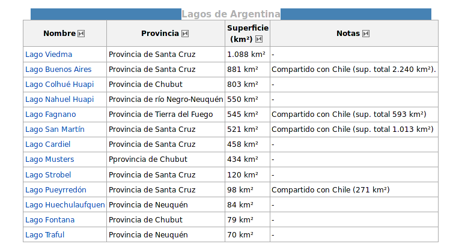

PyQuery: (des)trozemos la web
=============================

- jquery-like library. Misma API de selectors y traversing
- Lo que hace Beautiful Soup
- Azúcar arriba de ``lxml``
- Scrapping, templates, testing ... 
- Genial si ya conoces jQuery. Fácil y elegante

.. code-block:: python

    from pyquery import PyQuery as pq

    d = pq("<html></html>")
    d = pq('http://google.com')
    d = pq(url='http://google.com', opener=lambda url: urllib... )
    d = pq(filename=path_to_html_file)

y entonces?
===========

- ``d`` es como ``$`` en jquery

- Ejemplo: obtener la lista de 'Lagos de Argentina' de un artículo de Wikipedia.

A destrozar!
============

.. code-block:: python

   >>> d = pq(u"http://es.wikipedia.org/wiki/Geografía_de_la_Argentina") 
   >>> lagos = d(":contains('Lagos de Argentina')").parents('table tr td a')
   >>> print [e.text for e in lagos]
   ['Lago Viedma',
     'Lago Buenos Aires',
     u'Lago Colhu\xe9 Huapi',
     'Lago Nahuel Huapi',
     'Lago Fagnano',
     u'Lago San Mart\xedn',
     'Lago Cardiel',
     'Lago Musters',
     'Lago Strobel',
     u'Lago Pueyrred\xf3n',
     'Lago Huechulaufquen',
     'Lago Fontana',
     'Lago Traful']

Les gustó ?
===========

.. class:: align-center

   http://pypi.python.org/pypi/pyquery

   http://api.jquery.com/ 

   http://pypi.python.org/pypi/CuevanaLinks 
